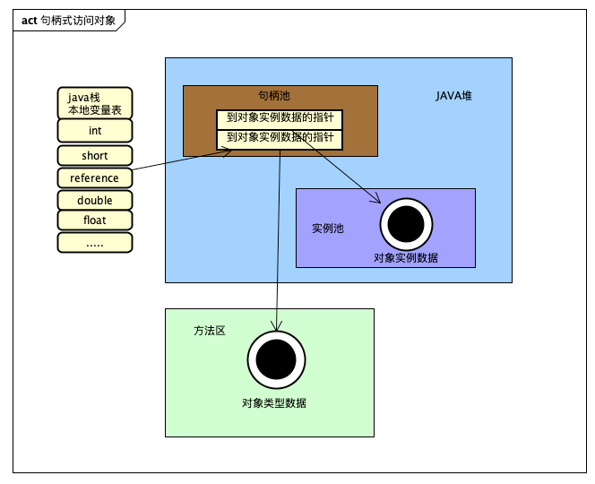
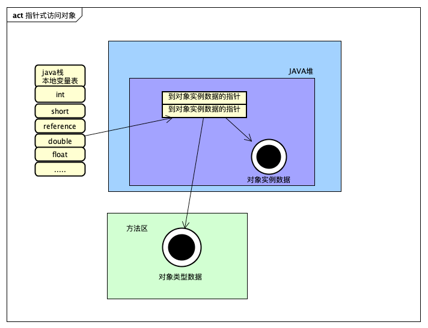

> 由于Java面向对象的思想，在JVM中需要大量存储对象，存储时为了实现一些额外的功能，需要在对象中添加一些标记字段用于增强对象功能 。在学习并发编程知识`synchronized`时，我们总是难以理解其实现原理，因为偏向锁、轻量级锁、重量级锁都涉及到对象头，所以了解`java`对象头是我们深入了解`synchronized`的前提条件,以下我们使用`64位JDK示例`


### 1.对象布局的总体结构

### 2.获取一个对象布局实例

1.首先在maven项目中 引入查看对象布局的神器

```xml
		<dependency>
			<groupId>org.openjdk.jol</groupId>
			<artifactId>jol-core</artifactId>
			<version>0.9</version>
		</dependency>
```

2.调用ClassLayout.parseInstance().toPrintable()

```java

public class Main{
    public static void main(String[] args) throws InterruptedException {
        L l = new L();  //new 一个对象 
        System.out.println(ClassLayout.parseInstance(l).toPrintable());//输出 l对象 的布局
    }
}
//对象类
class L{
    private boolean myboolean = true;
}
```

运行后输出:

```java
 OFFSET  SIZE      TYPE DESCRIPTION                               VALUE
      0     4           (object header)                           01 00 00 00 (00000001 00000000 00000000 00000000) (1)
      4     4           (object header)                           00 00 00 00 (00000000 00000000 00000000 00000000) (0)
      8     4           (object header)                           f0 e4 2c 11 (11110000 11100100 00101100 00010001) (288154864)
     12     4           (object header)                           01 00 00 00 (00000001 00000000 00000000 00000000) (1)
     16     1   boolean L.myboolean                               true
     17     7           (loss due to the next object alignment)
Instance size: 24 bytes
Space losses: 0 bytes internal + 7 bytes external = 7 bytes total
```

对象头所占用的内存大小为`16*8bit=128bit`。如果大家自己动手去打印输出，可能得到的结果是`96bit`，这是因为我关闭了指针压缩。`jdk8`版本是默认开启指针压缩的，可以通过配置`vm`参数关闭指针压缩。关于更多压缩指针访问JAVA文档:[官网](http://docs.oracle.com/javase/7/docs/technotes/guides/vm/performance-enhancements-7.html)

```java
关闭指针压缩		-XX:-UseCompressedOops 
```

开启指针压缩之后，再看对象的内存布局:

```java
 OFFSET  SIZE      TYPE DESCRIPTION                               VALUE
      0     4           (object header)                           01 00 00 00 (00000001 00000000 00000000 00000000) (1)
      4     4           (object header)                           00 00 00 00 (00000000 00000000 00000000 00000000) (0)
      8     4           (object header)                           43 c1 00 f8 (01000011 11000001 00000000 11111000) (-134168253)
     12     1   boolean L.myboolean                               true
     13     3           (loss due to the next object alignment)
Instance size: 16 bytes
Space losses: 0 bytes internal + 3 bytes external = 3 bytes total
```

- OFFSET：偏移地址，单位字节；
- SIZE：占用的内存大小，单位为字节；
- TYPE DESCRIPTION：类型描述，其中`object header`为对象头；
- VALUE：对应内存中当前存储的值；

> 开启指针压缩可以减少对象的内存使用。因此，开启指针压缩，理论上来讲，大约能节省百分之五十的内存。`jdk8`及以后版本已经默认开启指针压缩，无需配置。

普通的对象获取到的对象头结构为:

```ruby
|--------------------------------------------------------------|
|                     Object Header (128 bits)                 |
|------------------------------------|-------------------------|
|        Mark Word (64 bits)         | Klass pointer (64 bits) |
|------------------------------------|-------------------------|
```

普通对象`压缩后`获取结构:

```java
|--------------------------------------------------------------|
|                     Object Header (96 bits)                  |
|------------------------------------|-------------------------|
|        Mark Word (64 bits)         | Klass pointer (32 bits) |
|------------------------------------|-------------------------|
```


数组对象获取到的对象头结构为:

```ruby
|---------------------------------------------------------------------------------|
|                                 Object Header (128 bits)                        |
|--------------------------------|-----------------------|------------------------|
|        Mark Word(64bits)       | Klass pointer(32bits) |  array length(32bits)  |
|--------------------------------|-----------------------|------------------------|
```

```java
 OFFSET  SIZE   TYPE DESCRIPTION                               VALUE
      0     4        (object header)                           01 00 00 00 (00000001 00000000 00000000 00000000) (1)
      4     4        (object header)                           00 00 00 00 (00000000 00000000 00000000 00000000) (0)
      8     4        (object header)                           6d 01 00 f8 (01101101 00000001 00000000 11111000) (-134217363)
     12     4        (object header)                           05 00 00 00 (00000101 00000000 00000000 00000000) (5)
     16    20    int [I.<elements>                             N/A
     36     4        (loss due to the next object alignment)
Instance size: 40 bytes
Space losses: 0 bytes internal + 4 bytes external = 4 bytes total
```

### 3.对象头的组成

我们先了解一下，一个JAVA对象的存储结构。在Hotspot虚拟机中，对象在内存中的存储布局分为 3 块区域：对象头（Header）、实例数据（Instance Data）和对齐填充（Padding）
在我们刚刚打印的结果中可以这样归类:

```java
 OFFSET  SIZE      TYPE DESCRIPTION                               VALUE
      0     4           (object header)    //markword             01 00 00 00 (00000001 00000000 00000000 00000000) (1)
      4     4           (object header)    //markword             00 00 00 00 (00000000 00000000 00000000 00000000) (0)
      8     4           (object header)   //klass pointer 类元数据 43 c1 00 f8 (01000011 11000001 00000000 11111000) (-134168253)
     12     1   boolean L.myboolean                               true	// Instance Data 对象实际的数据
     13     3           (loss due to the next object alignment)			//Padding 对齐填充数据
```


#### 1.Mark Word

这部分主要用来存储对象自身的运行时数据，如hashcode、gc分代年龄等。`mark word`的位长度为JVM的一个Word大小，也就是说32位JVM的`Mark word`为32位，64位JVM为64位。
为了让一个字大小存储更多的信息，JVM将字的最低两个位设置为标记位，不同标记位下的Mark Word示意如下：


其中各部分的含义如下：
**lock**:2位的锁状态标记位，由于希望用尽可能少的二进制位表示尽可能多的信息，所以设置了lock标记。该标记的值不同，整个mark word表示的含义不同。
通过倒数三位数 我们可以判断出锁的类型

```c++
enum {  locked_value             	= 0, // 0 00 轻量级锁
         unlocked_value           = 1,// 0 01 无锁
         monitor_value            = 2,// 0 10 重量级锁
         marked_value             = 3,// 0 11 gc标志
         biased_lock_pattern      = 5 // 1 01 偏向锁
  };
```

##### 通过内存信息分析锁状态

写一个synchronized加锁的demo分析锁状态
接着，我们再看一下，使用`synchronized`加锁情况下对象的内存信息，通过对象头分析锁状态。

代码:

```java
public class Main{
    public static void main(String[] args) throws InterruptedException {
        L l = new L();
        Runnable RUNNABLE = () -> {
            while (!Thread.interrupted()) {
                synchronized (l) {
                    String SPLITE_STR = "===========================================";
                    System.out.println(SPLITE_STR);
                    System.out.println(ClassLayout.parseInstance(l).toPrintable());
                    System.out.println(SPLITE_STR);
                }
                try {
                    Thread.sleep(1000);
                } catch (InterruptedException e) {
                    e.printStackTrace();
                }
            }
        };
        for (int i = 0; i < 3; i++) {
            new Thread(RUNNABLE).start();
        }
    }
}

class L{
    private boolean myboolean = true;
}
```

 

输出:

```java
===========================================
 OFFSET  SIZE      TYPE DESCRIPTION                               VALUE
      0     4           (object header)                           5a 97 02 c1 (01011010 10010111 00000010 11000001) (-1056794790)
      4     4           (object header)                           d7 7f 00 00 (11010111 01111111 00000000 00000000) (32727)
      8     4           (object header)                           43 c1 00 f8 (01000011 11000001 00000000 11111000) (-134168253)
     12     1   boolean L.myboolean                               true
     13     3           (loss due to the next object alignment)
Instance size: 16 bytes
Space losses: 0 bytes internal + 3 bytes external = 3 bytes total

===========================================
```

`Mark Word`为0X00007FD7C102975A 对应的2进制为: 0xb00000000 00000000 01111111 11010111 11000001 00000010 10010111 01011010
我们可以看到在第一行object header中 value=5a 对应的2进制为01011010  倒数第三位 为0表示不是偏量锁,后两位为10表示为`重量锁` 

```
enum {  locked_value             	= 0, // 0 00 轻量级锁
         unlocked_value           = 1,// 0 01 无锁
         monitor_value            = 2,// 0 10 重量级锁
         marked_value             = 3,// 0 11 gc标志
         biased_lock_pattern      = 5 // 1 01 偏向锁
  };
```

例子2:

```java
public class Main{
    public static void main(String[] args) throws InterruptedException {
        L l = new L();
        synchronized (l) {
            Thread.sleep(1000);
            System.out.println(ClassLayout.parseInstance(l).toPrintable());
            Thread.sleep(1000);
        }     //轻量锁
    }
}

class L{
    private boolean myboolean = true;
}
```

输出:

```java
 OFFSET  SIZE      TYPE DESCRIPTION                               VALUE
      0     4           (object header)                           f0 18 58 00 (11110000 00011000 01011000 00000000) (5773552)
      4     4           (object header)                           00 70 00 00 (00000000 01110000 00000000 00000000) (28672)
      8     4           (object header)                           43 c1 00 f8 (01000011 11000001 00000000 11111000) (-134168253)
     12     1   boolean L.myboolean                               true
     13     3           (loss due to the next object alignment)
Instance size: 16 bytes
Space losses: 0 bytes internal + 3 bytes external = 3 bytes total
```

对应的`mark word`为0x00007000005818f0 对应的2进制为0xb00000000 00000000 01110000 00000000 00000000 01011000 00011000 11110000
根据末尾倒数第三位为0 表示不是偏量锁 倒数后2位为00 表示这是一个轻量锁

```java
enum {  locked_value             	= 0, // 0 00 轻量级锁
         unlocked_value           = 1,// 0 01 无锁
         monitor_value            = 2,// 0 10 重量级锁
         marked_value             = 3,// 0 11 gc标志
         biased_lock_pattern      = 5 // 1 01 偏向锁
  };
```

你可能会有疑问mark word = 0x00007000005818f0是怎么算出来的, 根据前64位的value倒序排列拼成的串就是mark word
例子:

```java
 OFFSET  SIZE      TYPE DESCRIPTION                               VALUE
      0     4           (object header)                           f0 18 58 00 (11110000 00011000 01011000 00000000) (5773552)
      4     4           (object header)                           00 70 00 00 (00000000 01110000 00000000 00000000) (28672)
      8     4           (object header)                           43 c1 00 f8 (01000011 11000001 00000000 11111000) (-134168253)
     12     1   boolean L.myboolean                               true
     13     3           (loss due to the next object alignment)
```

Mark word 串为 前64位倒序排列为:00000000 00000000 01110000 00000000 00000000 01011000 00011000 11110000
转换为16进制为 00007000005818f0

#### 2.Klass Pointer

即对象指向它的元数据的指针，虚拟机通过这个指针来确定是哪个类的实例。并不是所有的虚拟机实现都必须在对象数据上保留类型指针(通过句柄池访问)。

> 简单引申一下对象的访问方式，我们创建对象的目的就是为了使用它。所以我们的Java程序在运行时会通过虚拟机栈中本地变量表的reference数据来操作堆上对象。但是reference只是JVM中规范的一个指向对象的引用，那这个引用如何去定位到具体的对象呢？因此，不同的虚拟机可以实现不同的定位方式。主要有两种：句柄池和直接指针。

##### 2.1 使用句柄访问

会在堆中开辟一块内存作为句柄池，句柄中储存了对象实例数据（属性值结构体）的内存地址，访问类型数据的内存地址（类信息，方法类型信息），对象实例数据一般也在heap中开辟，类型数据一般储存在方法区中。

**优点**：reference存储的是稳定的句柄地址，在对象被移动（垃圾收集时移动对象是非常普遍的行为）时只会改变句柄中的实例数据指针，而reference本身不需要改变。
**缺点**：增加了一次指针定位的时间开销。



##### 2.2 使用指针访问

指针访问方式指reference中直接储存对象在heap中的内存地址，但对应的类型数据访问地址需要在实例中存储。

**优点**：节省了一次指针定位的开销。
**缺点**：在对象被移动时(如进行GC后的内存重新排列)，reference本身需要被修改。



总结:

> 通过句柄池访问的话，对象的类型指针是不需要存在于对象头中的，但是目前大部分的虚拟机实现都是采用直接指针方式访问。此外如果对象为JAVA数组的话，那么在对象头中还会存在一部分数据来标识数组长度，否则JVM可以查看普通对象的元数据信息就可以知道其大小，看数组对象却不行

#### 3. 对齐填充字节

> 因为JVM要求java的对象占的内存大小应该是8bit的倍数，所以后面有几个字节用于把对象的大小补齐至8bit的倍数，就不特别介绍了

### 4.JVM升级锁的过程

1，当没有被当成锁时，这就是一个普通的对象，Mark Word记录对象的HashCode，锁标志位是01，是否偏向锁那一位是0。

2，当对象被当做同步锁并有一个线程A抢到了锁时，锁标志位还是01，但是否偏向锁那一位改成1，前23bit记录抢到锁的线程id，表示进入偏向锁状态。

3，当线程A再次试图来获得锁时，JVM发现同步锁对象的标志位是01，是否偏向锁是1，也就是偏向状态，Mark Word中记录的线程id就是线程A自己的id，表示线程A已经获得了这个偏向锁，可以执行同步锁的代码。

4，当线程B试图获得这个锁时，JVM发现同步锁处于偏向状态，但是Mark Word中的线程id记录的不是B，那么线程B会先用CAS操作试图获得锁，这里的获得锁操作是有可能成功的，因为线程A一般不会自动释放偏向锁。如果抢锁成功，就把Mark Word里的线程id改为线程B的id，代表线程B获得了这个偏向锁，可以执行同步锁代码。如果抢锁失败，则继续执行步骤5。

5，偏向锁状态抢锁失败，代表当前锁有一定的竞争，偏向锁将升级为轻量级锁。JVM会在当前线程的线程栈中开辟一块单独的空间，里面保存指向对象锁Mark Word的指针，同时在对象锁Mark Word中保存指向这片空间的指针。上述两个保存操作都是CAS操作，如果保存成功，代表线程抢到了同步锁，就把Mark Word中的锁标志位改成00，可以执行同步锁代码。如果保存失败，表示抢锁失败，竞争太激烈，继续执行步骤6。

6，轻量级锁抢锁失败，JVM会使用自旋锁，自旋锁不是一个锁状态，只是代表不断的重试，尝试抢锁。从JDK1.7开始，自旋锁默认启用，自旋次数由JVM决定。如果抢锁成功则执行同步锁代码，如果失败则继续执行步骤7。

7，自旋锁重试之后如果抢锁依然失败，同步锁会升级至重量级锁，锁标志位改为10。在这个状态下，未抢到锁的线程都会被阻塞。

总结:本章节主要介绍了对象布局包含对象头,对象实例数据,和对齐数据.并且介绍了对象头中包含的信息和解析方法
更多内容请持续关注公众号:`java宝典`

