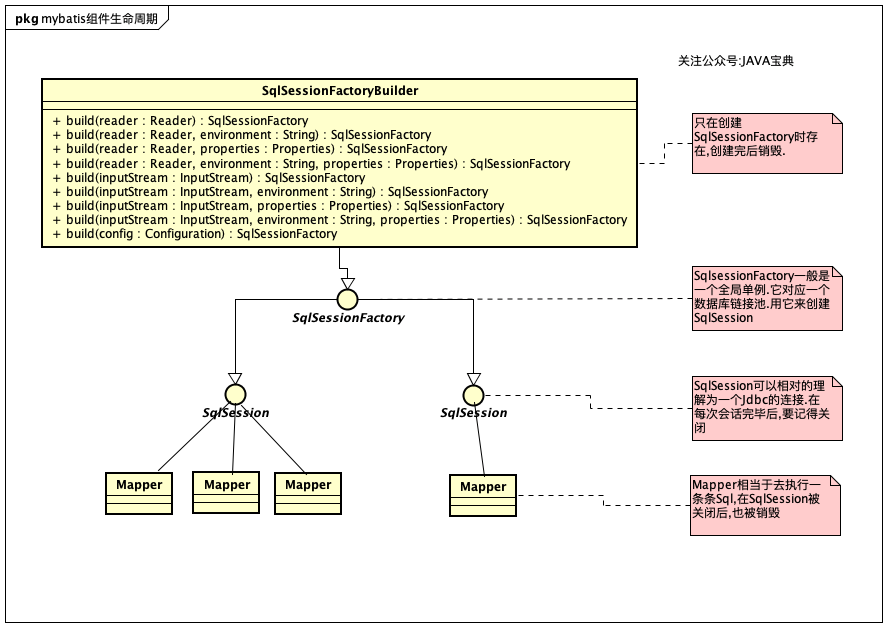

### Mybatis中重要组件的生命周期
在之前的章节中我们讲了Mybatis一些主要组件的基本用法和配置方式,但是掌握这些主要组件的生命周期也是非常重要的,不能只是单单了解基本的使用方法。这对于MyBatis应⽤的正确性和高性能是极其重要的，我们必须掌握他们

本单主要内容:

以下各组件的生命周期理解:

- SqlSessionFactoryBuilder
- SqlSessionFactory
- SqlSession
- Mapper

#### SqlSessionFactoryBuilder 

>SqlSessionFactoryBuilder是利用XML或者Java编码获得资源来构建SqlSessionFactory
>的，通过它可以构建多个SessionFactory。它的作⽤用就是一个构建器`一旦我们构建了SqlSessionFactory 它的作用就⼰经完结`，失去了存在的意义，这时我们就应该毫不犹豫的废弃它，将它回收。

所以它的⽣命周期只存在于⽅法的局部，`它的作用就是⽣成SqlSessionFactory对象`

#### SqlSessionFactory

>SqlSessionFactory的作用是创建SqlSession，而SqlSession就是一个会话，相当于JDBC
>中的Connection对象。每次应用程序需要访问数据库，我们就要通过SqlSessionFactory创
>建SqlSession，所以`SqlSessionFactory应该在MyBatis应用的整个⽣命周期中`。而如果我们
>多次创建同一个数据库的SqlSessionFactory，则每次创建SqlSessionFactory会打开更更多的数
>据库连接（Connection）资源，那么连接资源就很快会被耗尽(这就很严重!)

因此SqlSessionLFactory的责任是唯一的，它的责任就是创建SqlSession，所以我们果断采用单例模式。如果我们采用多例，那么它对数据库连接的消耗是很大的，不利于我们统⼀的管理,所以正确的做法应该是使得每⼀个数据库只对应一个SqlSessionFactory，管理好
数据库资源的分配，避免过多的Connection被占用,导致数据库连接被占满.
#### SqlSession

>SqlSession是⼀个会话，相当于JDBC的一个Connection对象，它的⽣命周期应该是
>`在请求数据库处理事务的过程中`

它是一个线程不安全的对象，在涉及多线程的时候我们
需要特别的当心，操作数据库需要注意其隔离级别，数据库锁等⾼级特性。此外，每次创
建的SqlSession都必须及时关闭它，它长期存在就会使数据库连接池的活动资源减少，对
系统性能的影响很大。正如Mybatis源码阅读(一)中的代码⼀样，我们往往通过finally语句块保证我们正确
的关闭了SqlSession

#### Mapper

Mapper是个接⼝，⽽没有任何实现类，它的作⽤是发送SQL，然后返回我们需要的结果 `因此它的生命周期应该在⼀个SqlSession事务⽅法之内`，它的最大范围和SqlSession是相同的

### 总结
有了上面的叙述后,我们已经清楚了 Mybatis各组件的生命周期和联系:

